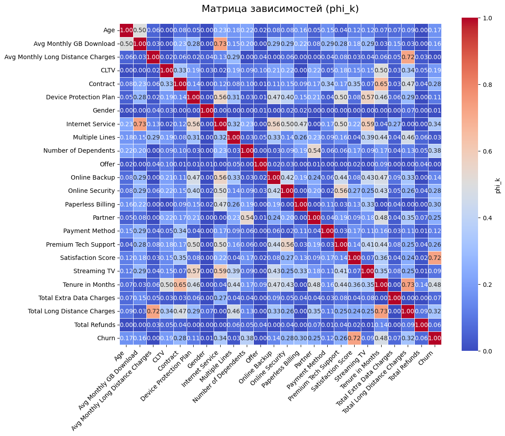
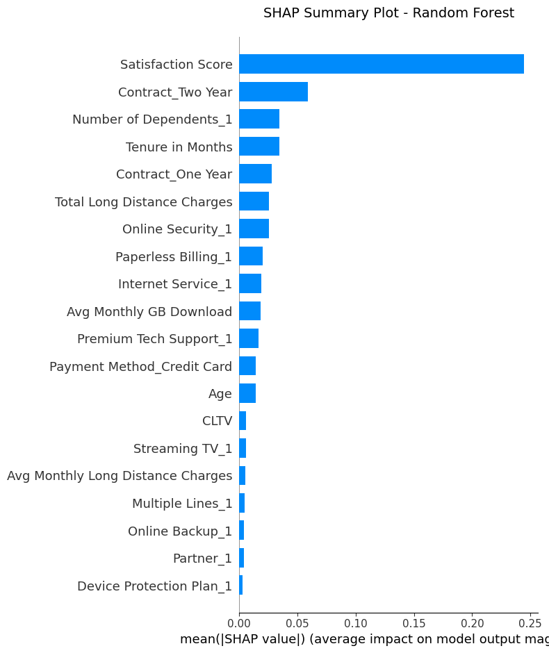
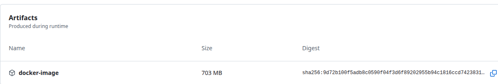

[](https://github.com/Valuxalo/ML_telco_customer_churn/actions/workflows/ci.yml)

# Тема проекта
Прогнозирование оттока клиентов телекоммуникационных компаний

# Автор
Кулакова Валентина Валерьевна - студентка магистратуры УрФУ направления "Инженерия машинного обучения" (2025-2027г)

# Анализ проблемы

## Описание задачи
Для телекоммуникационных компаний очень важно удержать клиента, так как в условиях высокой конкуренции клиент легко может уйти к другому оператору связи или провайдеру. Для этого необходимо выявлять на раннем сроке клиентов, кто находится в группе риска расторжения договора с компанией, чтобы предложить им персонализированные условия (скидки, бонусы) и тем самым снизить потери абонентской базы.

## Цель проекта
Разработка модели машинного обучения для прогнозирования оттока клиентов телекоммуникационной компании с целью своевременного выявления клиентов, склонных к расторжению договора, и снижения уровня оттока за счёт персонализированных мер удержания.

## Основные задачи проекта
- Сбор и анализ данных о клиентах телекоммуникационной компании.
- Исследовательский анализ данных (EDA). Анализ признаков, зависимостей и формирование признаков для обучения модели.
- Обучение и сравнение различных моделей машинного обучения:
    - Logistic Regression;
    - Random Forest;
    - CatBoost и др.
- Оценка качества моделей с использованием метрик:
    - Accuracy
    - Recall - основная метрика
    - F1-score
- Выбор оптимальной модели прогнозирования.
- Интерпретация результатов и определение ключевых факторов оттока.
- Упаковка проекта в docker
- Мониторинг метрик, параметров системы

## Проблемы, которые решает проект
- Высокий уровень оттока клиентов в телекоммуникационной компании.
- Потери прибыли из-за ухода абонентов к конкурентам.
- Сложность своевременного выявления клиентов, находящихся в зоне риска.
- Высокие затраты на привлечение новых клиентов по сравнению с удержанием существующих.
- Отсутствие персонализированного подхода к удержанию клиентов.
- Неэффективное использование маркетинговых ресурсов и программ лояльности.

## Практическая значимость проекта
Результаты проекта помогут компании:
- повысить уровень удержания клиентов
- снизить финансовые потери
- улучшить качество клиентского сервиса
- повысить эффективность маркетинговых кампаний

# Общее описание проекта
## Данные
Ссылка на датасет: https://huggingface.co/datasets/aai510-group1/telco-customer-churn

Это объединённые набор данных об оттоке клиентов телекоммуникационных компаний, который имеет 51 признак, описывающие разные параметры абонентов, такие как демографические и финансовые факторы, использование услуг. Объём датасета - 7000 строк. Особенностью данного датасета является наличие 3-х сплитов: train, validation, test, что позволит избежать ручного деления датасета.

## Инструменты
- Pandas
- Scikit-learn
- PyTest
- Docker
- Github-Actions
- Mlflow

## Структура проекта
```telco_project/
├── data/
│   ├── processed/
│   └── raw/
├── notebooks/
│   ├── EDA.ipynb
│   ├── load_data.ipynb
│   └── ML.ipynb
├── artifacts/
├── mlartifacts/
├── mlruns/
├── src/
│   ├── __init__.py
│   ├── main_pipeline.py
│   ├── load_data.py
│   ├── preprocessing.py
│   ├── ml_model.py
│   ├── predict.py
│   └── save_model.py
├── tests/
│   ├── __init__.py
│   ├── test_load_data.py
│   ├── test_preprocessing.py
│   ├── test_save_model.py
│   └── test_predict.py
```

Основной pipeline (main_pipeline.py) содержит последовальное выполнение функций для загрузки данных (load_data), трансформация данных (process_all_files), обучение модели (train_model), получение метрик модели на тесте (predict) и сохранение модели (save_model). 

Тестирование проекта реализовано через PyTest. Мониторинг метрик моделей и инфрастрктуры, а также управление моделями реализовано в Mlflow. Контейнеризация проекта выполнена с помощью Docker. Тестирование и создание образа контейнера осуществляется через Github Actions, запуск происходит после каждого git push в репозиторий преокта. 

## Основные команды запуска
### Запуск Docker
1. Скачать Artifacts из Github Actions и docker-compose.yml из проекта
2. Разархивировать архив:
```
unzip docker-image.zip
```
3. Загрузить образ:
```
docker load -i ml-model.tar 
```
4. Запустить docker-compose:
```
docker-compose up -d
```
5. Данные будут в папке data, а артефакты работы модели в папке artifacts.

### Запуск Mlflow
1. Скачать весь проект
2. В .env выбрать модель
3. Запустить mlflow:
```
mlflow server \
--backend-store-uri sqlite:///mlflow.db \
--default-artifact-root ./mlruns \
--host 127.0.0.1 \
--port 5000
```
4. В другому командном окне запустить основной пайплайн:
```
python ./src/main_pipeline.py
```
# ETL (Extract, Transform, Load)

## Извлечение данных (Extract)
Данные загружены по протоколу `hf://`, который позволяет напрямую загружать данные из репозитория Hugging Face. Используемый датасет имеет 3 сплита: train, validation, test. В конце ссылки необходимо указываеть название сплита, для скачивания того или иного датасета. 

Датасет содержит 51 признак и одну целевую переменную Churn (отток, 0/1). Описание всех признаков приведено в notebooks/EDA.ipynb. Признаки описывают клиента с точки зрения демографии (возраст, город, статус замужества, наличие иждивенцов), потребляемых услуг (расход Gb, наличие теелфонных, интернет услуг, пользование стримимнгом), финансов (общая сумма затрат, затраты на каждый вид услуги, возвраты), отношения к компании (как долго клиент пользуется услугами компании, что ему предлагали, уровень удовлетворённости, наличие премиальной технической поддержи). Так как число признаков большое, то был произведён отбор признаков.

### Важность отбора признаков
Основная идея отбора - избежание переобучения модели и улучшение качества модели.

Отбор признаков позволяет:
- уменьшить размерность пространства
- сократить вычислительные затраты
- ускорить обучение и предсказания
- повысить интерпретируемость признаков
- снижения экономических трат для сбора данных в будущем (в дальнейшем потребуется потратить меньше сил и ресурсов для сбора данных по малому набору признаков) 

### Отбор признаков
Применены методы фильтрации до обучения модели на основе визуального анализа (описание признака). Были удалены признаки, которые:
- объясняют целевую переменную (Churn Category, Churn Reason, Churn Score)
- уникальные (Customer ID)
- повторяются (Dependents)
- не имеют контекста в рамках ML (Latitude, Longitude, Zip Code)
- были получены из других признаков (Senior Citizen,Under 30 )

## Преобразование данных (Transform)

После фильтрации признаков тренировочный датасет имеет размерность: `(4225, 38)`. В датасете нет дублирующих строк, и у двух признаков есть пропущенные значения NaN, а именно у Тип интернета и Принятое маркетинговое предложение. Так как тип интернета действительно может отсутствовать (например, клиент не пользуется интернетов) и предложение тоже могло быть не предложено клиенту, то значения NaN было трансформировано в 0, как отдельную категорию. 
Вычислены признаки с одним уникальным значением: Country, Quarter, State, которые были удалены, так как не несут смысловую нагрузку для ML-модели.
Разделим признаки на категориальные и числовые, также выделим отдельно целевую переменную. 

### Числовые признаки
Из графиков распределения (`/notebooks/EDA.ipynb`) видно, что есть очень много скошенных вправо признаков и признаков, где преобладает число значений равное нулю. Измерим скошенность и посчитаем число нулевых значений относительно всего датасета.

Скошенность:
```
Total Refunds                        4.303082
Total Extra Data Charges             4.051127
Number of Dependents                 2.015498
Number of Referrals                  1.415296
Total Long Distance Charges          1.212608
Avg Monthly GB Download              1.196216
Total Charges                        0.938816
Total Revenue                        0.901802
```
Доля нулей в каждом признаке:
```
Total Refunds                        0.924260
Total Extra Data Charges             0.893491
Number of Dependents                 0.766864
Number of Referrals                  0.540118
Avg Monthly GB Download              0.209704
Avg Monthly Long Distance Charges    0.100592
Total Long Distance Charges          0.100592
```
Признаки `Total Refunds`, `Total Extra Data Charges`, `Number of Dependents`, `Number of Referrals` имееют сильную скошенность за счёт большого числа нулей в датасете (>50%), остальные значения не будут нести информацию для модели и модель не сможет их обобщить. В таком случае можно перевести данные признаки в бинарный вид. Вместо сумм и числа -> есть или нет (0/1). Данные признаки переносятся в категориальные. 

Отдельно стоит описать признак `Satisfaction Score` - уровень удовлетворённости. Он относится к порядковой шкале измерения, имеет 5 значений оценки от 1 до 5, поскольку значения отражают степень удовлетворённости клиента и имеют естественный порядок. В модели машинного обучения данный признак используется как числовой порядковый параметр.

Итогом обработки числовых признаков стало наличие 10 числовых признаков и сохранения скошенных признаков с коэффициентов скошенности больше 0.5 в отдельный список. Он может пригодится для пременения трансформаций (Log или Robust Scaler) при обучения моделей, которые чувствительны к виду распределения признака. 

### Категориальные признаки
Построены графики распределения (`/notebooks/EDA.ipynb`) из которых видно, что все признаки сбалансированы, кроме признака `Offer`. Для данного признака выше была добавлена отдельная категория в виде 0 (отсутствие предложения), которая сильно перевешивает остальные признаки: 2324 значения против общего числа строк 4225. Данный признак преобразован в бинарный вид.

### Оценка зависимостей

Построена матрица корреляций PhiK, предназначенная для анализа зависимостей между признаками разных типов числовыми и категориальными. Она хорошо находит нелинейные зависимости и показывает связь категориальные признаки, что не отображает корреляция Пирсона. Сильно коррелированные признаки (`∣r∣ > 0.8`) обычно удаляют, так как они содержат одну и ту же информацию, могут ухудшать интепретируемость и делают модель менее устойчивой и переобучаемой. 

Так как число признаков ещё большое, то отобразим в числовом формате список пар признаков, которые имеют коэффициент корреляции `∣r∣ > 0.8`:
```
Phone Service <-> Avg Monthly Long Distance Charges: 0.882
Monthly Charge <-> Internet Service: 0.999
Unlimited Data <-> Internet Service: 0.922
Monthly Charge <-> Internet Type: 0.864
Unlimited Data <-> Internet Type: 0.922
Number of Referrals <-> Married: 0.997
Referred a Friend <-> Married: 0.997
Internet Service <-> Monthly Charge: 0.999
Internet Type <-> Monthly Charge: 0.864
Phone Service <-> Monthly Charge: 0.839
Streaming Movies <-> Monthly Charge: 0.823
Streaming TV <-> Monthly Charge: 0.834
Unlimited Data <-> Monthly Charge: 0.887
Married <-> Number of Referrals: 0.997
Partner <-> Number of Referrals: 0.997
Number of Referrals <-> Partner: 0.997
Referred a Friend <-> Partner: 0.997
Avg Monthly Long Distance Charges <-> Phone Service: 0.882
Monthly Charge <-> Phone Service: 0.839
Married <-> Referred a Friend: 0.997
Partner <-> Referred a Friend: 0.997
Monthly Charge <-> Streaming Movies: 0.823
Streaming Music <-> Streaming Movies: 0.971
Streaming Movies <-> Streaming Music: 0.971
Monthly Charge <-> Streaming TV: 0.834
Total Charges <-> Tenure in Months: 0.843
Total Revenue <-> Tenure in Months: 0.837
Tenure in Months <-> Total Charges: 0.843
Total Revenue <-> Total Charges: 0.934
Tenure in Months <-> Total Revenue: 0.837
Total Charges <-> Total Revenue: 0.934
Internet Service <-> Unlimited Data: 0.922
Internet Type <-> Unlimited Data: 0.922
Monthly Charge <-> Unlimited Data: 0.887
```
Видим, что коррелирую между собой:
- виды предоставляемых услуг клиент
- наличие партнёра, статус замужества и наличие рекомендаций со стороны друзей
- все денежные суммы, так как одна сумма может быть частью другой

В итоге оставлены следующие признаки: `Partner`, `Internet Service` и `Tenure in Months`. 

### Результат преобразования
Тренировочный датасет имеет размер `(4225, 23)`. 

Вид матрицы корреляций:


## Transform Pipeline
По результатам исследования признаков, был создан общий pipeline с помощью FunctionTransformer, который состоит из 3-х этапов:
- удаление всех ненужных столбцов
- заполнение пропущенных значений нулями для категориальных признаков и средними значениями для числовых
- перевод в бинарный вид

Данный pipeline позволяет одной строкой кода применить все трансформации ко всем датасетам.

### Целевая переменная
Бинарная переменная отток имеет дисбаланс, факт оттока клиентов является минорным классом в задаче классификации, около 25%. 

## Загрузка (Load)
Итоговый преобразованный датасет был сохранён в формате .csv  в папку `/data/processed`. 

# ML-модель

## Логистическая регрессия

В качестве baseline-модели выбрана модель логистической регрессии. Данная модель чувствительная к масштабу признаков, поэтом для числовых признаков необходима стандартизация. Также модель не работает со строками в категориальных признаках, поэтому категории кодируются в бинарные признаки. 

Для подготовки данных к обучению логистической регрессии использовались трансформеры `StandardScaler` и `OneHotEncoder`. Реализован один pipeline для трансформации всех признаков и обучения модели: 

### Подбор гиперпараметров

Для повышения качества модели логистической регрессии был использован метод подбора гиперпараметров GridSearchCV. Данный метод позволяет автоматически перебрать различные комбинации параметров модели и выбрать наиболее эффективную конфигурацию на основе выбранной метрики качества. Перебирались следующие параметры: сила регуляризации, отношение l1, максимальное количество итераций обучения модели. Также используется кросс-валидация, чтобы получить более устойчивую оценку качества и уменьшить вероятность переобучения. 

### Выбор основной метрики

В качестве основной метрики для обучения и сравнения моделей был выбран Recall (полнота). 

Формула метрики:

$Recall = \frac{TP}{TP + FN}$

Определяет какую долю клиентов, которые действительно уйдут, модель смогла обнаружить. Для бизнеса важнее определить клиентов, которые действительно уйдут. Это ошибка второго рода, то есть нужно минимизировать `FN`. 

Если сравнивать с метрикой Precision, которая показывает сколько из уходящих клиентов действительно готовы уйти, то она менее опасна для бизнеса. В случае неверной классификации клиента бизнес предложит лишний бонус клиенту, но эти потери будут меньше, чем потеря реального клиента.

В идеале на практике смотрим на баланс, поэтмоу для сравнения всех модеелй F1-score тоже будет учитываться. 

## Обучение и предсказание

Модель обучается на тренировочных данных. Предсказание на кросс-валидации `Recall = 0.87`.

## Random Forest

В качестве второй модели классификации использована модель случайного леса — RandomForestClassifier. Данный алгоритм относится к ансамблевым методам машинного обучения и позволяет повысить качество классификации за счёт объединения множества деревьев решений.

Модель хорошо работает с нелинейными зависимостями, устойчива к выбросам, автоматически определяет важность признаков и снижает вероятность переобучения по сравнению с одним деревом решений. Random Forest не требует стандартизации признаков, однако нуждается в преобразовании категориальных переменных в числовой формат.

### Подбор гиперпараметров

Для поиска оптимальной конфигурации модели использовался GridSearchCV. Перебирались парметры: число деервьев, максимальная глубина, минимальное число объектов для разделения, минимальное число объектов в листе, количество признаков, случайно выбираемых при построении каждого разбиения и баланс классов. Тоже использовалась кросс-валидация и метрика Recall. 

## Обучение и предсказание

Модель обучается на тренировочных данных. Предсказание на кросс-валидации `Recall = 0.89`.

### Важность признаков

Для интерпретации модели Random Forest был использован метод SHAP (SHapley Additive exPlanations), который позволяет оценить вклад каждого признака в предсказания модели.

SHAP основан на теории кооперативных игр и вычисляет, насколько каждый признак влияет на итоговое решение модели.



Наибольшее влияние на прогноз оттока оказывает `Satisfaction Score`. Это означает, что уровень удовлетворённости клиента является ключевым фактором оттока. 

На втором месте признак `Contract_Two Year`. Наличие долгосрочного двухлетнего контракта связано со снижением вероятности оттока клиентов.

После идут признаки `Number of Dependents_1` и `Tenure in Months`, которые говорят о наличие иждевенцев и как долго клиент пользуется услугами оператора. 

Таким образом, SHAP позволиил интерпретировать чёрный ящик модели и объяснить бизнесу причины предскаханий модели. Полученные результаты подтверждают значимость поведенческих и сервисных факторов в задаче прогнозирования оттока клиентов. 


## CatBoost

Третьей моделью для построения прогноза оттока была выбрана модель CatBoost. CatBoost эффективно работает с категориальными признаками (в датасете категориальных признаков больше, чем числовых), устойчив к переобучению, хорошо справляется с несбалансированными данными, автоматически обрабатывает нелинейные зависимости. 

Перед построением модели передаётся список категориальных признаков напрямую в модель, используются автоматический баланс веса классов и механизм ранней останвоки обучения.

## Обучение и предсказание

Во время обучения в CatBoost передаются не только тренировочные данные, но и валидационные. Модель обучается на тренировочных данных, а качество контролируется на валидационной выборке. Предсказание на кросс-валидации `Recall = 0.91`, на train - `Recall = 0.95`. Данные знаечния являются достаточно высокими, что позволяет не использовать подбор гиперпараметров. В таком случае CatBoost показывает наилучшие результаты среди всех моделей, ряботая "из коробки". Также подбор гиперпараметров является трудозатратным процессом, а прирост метрики был бы минимальным. Таким образом, базовая модель уже показывает хорошую устойчивость и высокое качество на валидации. 

## Важность признаков

Для интерпретации модели CatBoost был использован встроенный метод оценки важности признаков `get_feature_importance()`. Данный механизм позволяет определить, какие признаки оказывают наибольшее влияние на предсказания модели. Полученные результаты анализа:

```
Топ-10 важных признаков (CatBoost):
                    feature  importance
         Satisfaction Score   85.377431
            Online Security    8.467659
                   Contract    1.496612
       Number of Dependents    1.453084
           Tenure in Months    1.147482
    Avg Monthly GB Download    0.663361
                       CLTV    0.642468
Total Long Distance Charges    0.545729
               Streaming TV    0.206173
                        Age    0.000000
```

Ключевым фактором оттока снова является уровень удовлетворённости. Вторым по значимости признаком оказался `Online Security`, то есть наличие услуги онлайн-безопасности. Использование доп.услуг оператора связи снижает вероятность ухода клиента. Остальные признаки имееют умеренное влияние, а часть признаков модель проигнорировала. Низкая важность отдельных признаков свидетельствует об их слабом вкладе в предсказание целевой переменной по сравнению с более информативными признаками модели.  Полученные результаты подтверждают, что поведенческие характеристики клиентов оказывают большее влияние на churn, чем демографические признаки.

## Сравнение моделей

| Модель | Recall | Precision | f1 | accuracy |
|---|-------------|-----------|----|----------|
| Logistic Regression | 0.87 | 0.94| 0.90 | 0.95 |
| Random Forest | 0.89 | 0.94| 0.91 | 0.96 |
| Catboost | 0.91 | 0.92| 0.91 | 0.96 |

По результатам сравнения моделей можно сделать вывод, что:
- ансамблевые методы превзошли Logistic Regression;
- Random Forest и CatBoost показали более высокую способность выявлять клиентов, склонных к оттоку;
- наилучший Recall продемонстрировал CatBoost. 

В ходе сравнительного анализа моделей наилучшие результаты показала модель CatBoost. Алгоритм продемонстрировал максимальное значение Recall = 0.91, что особенно важно для задачи прогнозирования оттока клиентов, где критично минимизировать количество пропущенных клиентов, склонных к уходу. Random Forest также показал высокое качество классификации, однако CatBoost оказался более эффективным благодаря способности лучше работать с категориальными признаками и сложными нелинейными зависимостями.

# Методы автоматизации

В рамках проекта прогнозирования оттока клиентов была реализована автоматизация основных этапов машинного обучения с использованием `Pipeline`, `ColumnTransformer` и инструментов автоматического подбора гиперпараметров библиотеки `scikit-learn`. Автоматизация позволила упростить процесс обучения моделей, обеспечить воспроизводимость экспериментов и снизить вероятность ошибок при обработке данных.

## Автоматизация preprocessing данных

Для автоматизации предварительной обработки данных использовался механизм Pipeline и ColumnTransformer.

Основные этапы preprocessing были разделены на:
- обработку числовых признаков
- обработку категориальных признаков

### Числовые признаки

Для числовых признаков применялся `StandardScaler`:
```
num_transformer = Pipeline([
    ('scaler', StandardScaler())
])
```

Автоматизация масштабирования числовых признаков позволила:
- автоматически стандартизировать данные
- исключить ручную обработку признаков
- обеспечить одинаковую обработку train, validation и test выборок, а также для новых данных.

### Категориальные признаки

Для категориальных признаков использовался `OneHotEncoder`:
```
cat_transformer = Pipeline([
    ('onehot', OneHotEncoder(
        drop='first',
        handle_unknown='ignore',
        sparse_output=False
    ))
])
```

Автоматическое кодирование категориальных признаков позволило:
- преобразовывать строковые значения в числовой формат
- предотвращать ошибки при появлении новых категорий
- уменьшить мультиколлинеарность с помощью drop='first'

Для объединения этапов обработки использовался ColumnTransformer. В таком случае preprocessing позволил одновременно обработать разные типы признаков, единый воспроизводимый pipeline, снижение риска data leakage.

## Автоматизация обучения моделей

Для автоматизации полного процесса обучения использовался pipeline, который совмещает в себе preprocessing данных и обучение модели. Использование pipeline обеспечивает сокращение количества ручного кода, воспроизводимость экспериментов, предотвращение утечки данных между train и test выборками.

## Автоматизация подбора гиперпараметров

Для автоматического поиска оптимальных параметров моделей использовался GridSearchCV. Автоматически выполнялись:
- перебор комбинаций гиперпараметров
- кросс-валидация
- оценка моделей
- выбор лучшей конфигурации

Кросс-валидация позволяет повыссить устойчивость оценки модели, уменьшить вероятность переобучения, получить более объективные результаты. 

## Автоматизация работы с дисбалансом классов
Для автоматической балансировки классов использовались:
- class_weight='balanced' в Random Forest
- auto_class_weights='Balanced' в CatBoost

Это позволяет автоматически учитывать дисбаланс классов и улучшить выявление минорного класса churn, за счёт этого повысить Recall.

## Автоматизация интерпретации модели
Для анализа важности признаков применялись:
- встроенный механизм get_feature_importance() в CatBoost
- SHAP-анализ в Random Forest

Это позволяет быстро оценить вклад признаков и интепретировать предсказания модели.

## Автоматизация экспериментов

В качестве хранения экспериментов используется MLflow. Он позволяет хранить все эксперименты, метрики, артифакты, также сравнивать модели между собой. Больше подходит для масштабного использования моделей в продуктовой среде. Подробно про реализацию MLflow в этом проекте описано в разделе мониторинга.

## Другие методы автоматизации 

Дополнительно можно использовать Optuna - метод автоподбора гиперпараметров. Другие методы поиска гиперпараметров: RandomizedSearchCV, HalvingGridSearchCV, BayesSearchCV. 

Вместо ручного построения модели можно использовать AutoML - систему автоматического машинного обучения. Она позволяет выполнять все процессы самостоятельно, минимизируя ручные настройки. 


## Вывод использования автоматизации
В проекте была реализована автоматизация основных этапов машинного обучения: preprocessing данных, обучение моделей, подбор гиперпараметров, кросс-валидация и интепретация моделей. Для этого использовались инструменты Pipeline, ColumnTransformer и GridSearchCV библиотеки scikit-learn, а также SHAP и встроенные механизмы моделей. Автоматизация позволила обеспечить воспроизводимость экспериментов, снизить вероятность ошибок обработки данных и упростить процесс тестирования и сравнения различных моделей машинного обучения.

# Тестирование
Для проверки корректности работы разработанного ML-пайплайна были реализованы автоматизированные тесты с использованием фреймворка pytest. Тестирование направлено на контроль целостности загруженных данных, корректности предобработки, наличия артефактов обучения и работоспособности обученной модели. 

Тесты можно запустить вручную. В данном проекте тесты прогоняются с помощью `CI Pipeline` в `Github Actions` после каждого push в репозиторий проекта.

## Проверка исходных данных

На первом этапе выполняется тестирование входных данных. Проверяется существование каталога с исходными данными (`/data/raw`) и наличие CSV-файлов. Данный тест позволяет убедиться в корректности структуры проекта и наличии необходимых данных для запуска ML-пайплайна.

## Проверка результатов предобработки данных

Для контроля качества preprocessing реализован тест, проверяющий содержимое каталога `/data/processed`. В рамках тестирования выполняются проверки наличия файлов после этапа предобработки, отсутствия пропущенных значений (NaN) и соответствия количества признаков определённому числу. Данный тест позволяет гарантировать корректность работы этапов очистки и подготовки данных перед обучением модели.

## Проверка артефактов модели

После завершения обучения модели выполняется проверка сформированных артефактов. Проверяется наличие следующих файлов:

- recall_score.txt;
- confusion_matrix.txt;
- feature_importance.txt.

Это позволяет убедиться в успешном завершении процесса обучения и сохранении результатов эксперимента.

## Проверка качества модели

Дополнительно реализована автоматическая проверка качества модели на основе метрики Recall. Из файла с результатами обучения извлекается значение метрики и проверяется выполнение следующих условий:

- значение находится в диапазоне от 0 до 1
- значение Recall превышает установленный порог 0,8

Данный тест обеспечивает контроль минимально допустимого качества модели и позволяет предотвратить использование моделей с неудовлетворительными результатами.

## Проверка сохранённой модели

Для проверки корректности сохранения модели реализован тест загрузки файлов формата .pkl и проверки возможности его использования с помощью применения метода predict.

Таким образом подтверждается возможность дальнейшего использования обученной модели для получения прогнозов.

## Результаты тестирования

В результате выполнения ряда тестов была проверена:

- корректность структуры проекта
- доступность исходных данных
- успешная предобработка датасета
- корректное сохранение артефактов обучения
- достижение требуемого качества модели по метрике Recall;
- работоспособность сохранённой модели после загрузки.

Автоматизация тестирования позволила повысить надёжность ML-пайплайна, обеспечить контроль качества на всех этапах обработки данных и минимизировать риск возникновения ошибок при последующих запусках проекта.

# Контейнеризация pipeline

Для обеспечения воспроизводимости среды выполнения и упрощения развертывания проекта была использована технология контейнеризации Docker. Контейнеризация позволяет упаковать приложение вместе со всеми необходимыми библиотеками, зависимостями и настройками окружения в единый контейнер, который может быть запущен на любой платформе, поддерживающей Docker.

В рамках проекта Docker использовался для запуска полного ML-пайплайна, включающего этапы загрузки данных, предобработки, обучения модели и сохранения артефактов.

## Dockerfile

Для создания образа контейнера был создан следующий Dockerfile:
```
FROM python:3.12.3

WORKDIR /app

# Копирование зависимостей
COPY requirements.txt .
RUN pip install --no-cache-dir -r requirements.txt

# Копирование всего проекта
COPY . .

# Команда по умолчанию
CMD ["python", "./src/main_pipeline.py"]
```

В качестве образа используется `python:3.12.3`, затем создаётся рабочая директория и устанавливаются зависимости. В директорию копируются файлы проекта и запускается основной pipeline. В директорию копируются не все файлы проекта, исключения описаны в `.dockerignore`. Сборка образа происходит каждый раз при каждом push командой:
```
docker build -t ml-model:latest .
```
# Docker Compose

Для автоматизация запуска контейнера используется Docker Compose. Конфигурация файла:
```
version: '3.8'

services:
  ml-pipeline:
    image: ml-model:latest
    container_name: ml-model
    volumes:
      - ./data:/app/data
      - ./artifacts:/app/artifacts
```
Compose берёт image, запускает его с именем `ml-model` и прокидывает volume, чтобы данные и артефакты были видны снаружи контейнера на хосте, где запускает compose. Благодаря использованию volume результаты не удаляются после остановки контейнера.

## Автоматическое создание Docker-образа

Сборка Docker-образа автоматизирована с помощью GitHub Actions.
Таким образом обеспечивается автоматизированное создание актуальной версии контейнера при каждом обновлении проекта. 

Сам образ можно скачать из артефактов Actions:



## Преимущества контейнеризации в проекте

Использование Docker позволяет:
- обеспечить воспроизводимость окружения
- автоматизировать развертывание ML-пайплайна
- ограничение доступа к файловой системе (за исключением смонтированных volume)
- упростить переносимость проекта между различными операционными системами
- повысить уровень безопасности приложения за счёт изоляции процессов и зависимостей внутри контейнера
